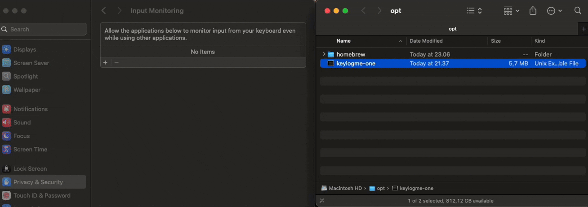

<!-- Improved compatibility of back to top link: See: https://github.com/othneildrew/Best-README-Template/pull/73 -->
<a id="readme-top"></a>
<!--


<!-- PROJECT LOGO -->
<br />
<div align="center">
  <a href="https://github.com/keylogme/keylogme-one">
    
  </a>

  <h3 align="center">Keylogme One</h3>

  <p align="center">
    This is the logger for <a href="https://keylogme.com">keylogme.com</a>. This logger
    records your keypresses stats and saves them in keylogme.com. 
    <br />
    <br />
    <a href="https://keylogme.com/esoteloferry/my-crkbd">View Demo</a>
    ·
    <a href="https://github.com/keylogme/keylogme-one/issues/new?labels=bug&template=bug-report---.md">Report Bug</a>
    ·
    <a href="https://github.com/keylogme/keylogme-one/issues/new?labels=enhancement&template=feature-request---.md">Request Feature</a>
  </p>
</div>


<!-- TABLE OF CONTENTS -->
<details>
  <summary>Table of Contents</summary>
  <ol>
    <li>
      <a href="#about-the-project">About The Project</a>
      <ul>
        <li><a href="#why?">Why?</a></li>
        <li><a href="#how?">How?</a></li>
        <li><a href="#what?">What?</a></li>
      </ul>
    </li>
    <li>
      <a href="#getting-started">Getting Started</a>
      <ul>
        <li><a href="#linux">Linux</a></li>
        <li><a href="#mac">Mac</a></li>
      </ul>
    </li>
    <li><a href="#config">Config</a>
      <ul>
        <li><a href="#config-linux">Linux</a></li>
        <li><a href="#config-mac">Mac</a></li>
      </ul>
    </li>
    <li><a href="#output">Output</a>
    <li><a href="#roadmap">Roadmap</a></li>
    <li><a href="#contributing">Contributing</a></li>
    <li><a href="#license">License</a></li>
    <li><a href="#contact">Contact</a></li>
    <li><a href="#acknowledgments">Acknowledgments</a></li>
  </ol>
</details>


<!-- ABOUT THE PROJECT -->
## About The Project

### Why?

The end goal is to avoid or diminish the pain in your hands due to typing. Commonly known as RSI (Repetitive Strain Injury), 
tennis elbow, carpal tunnel syndrome, etc.

There are many great ergonomic keyboards , beautiful hardware out there. However, what is the layout of keys 
that best suits you? that does not overload some fingers? that makes you more productive?.

We all started with QWERTY, then heard of DVORAK, COLEMAK, Workman, Norman, Asset, Capewell-Dvorak, BEAKL, MTGAP, QGMLWB... ?
Many layouts with a specific design criteria in mind but switching to one is not an easy task, you need a lot of practice and patience.

### How?

How can keylogme help?, here's how:

* Monitor : See the finger usage on your current layout based on your real usage
* Analyze : Compare your layout with others, find patterns to avoid or improve, remap shortcuts
* Adapt : fine tune or change your layout based on the stats

Of course, ergonomics is not just a nice keyboard and layout. It is also about posture, breaks, exercises.

### What?

So what is keylogme? well guessed, it is a keylogger!. You configure to track specific devices
you want to track. And it runs 24/7 in your computer as a service, collecting your keystrokes. 

There are 2 ways to use keylogme:

1. <a href="https://github.com/keylogme/keylogme-zero">keylogme-zero</a>: zero dependecies open source project that saves your stats locally. 
2. <a href="https://github.com/keylogme/keylogme-one">keylogme-one</a>: wrapper around keylogme-zero that saves your keystrokes in our server. 

What the f***? This is not safe! people will know what I write!
Our end goal is to have a heatmap of your keyboard usage, not to know what you write. See <a href="https://github.com/keylogme/keylogme-zero#security">Security section</a>
for more information on how we mingle your content so it is undecipherable.

<p align="right">(<a href="#readme-top">back to top</a>)</p>


<!-- GETTING STARTED -->
## Getting Started

### Linux

1. Clone the repo
   ```sh
   git clone https://github.com/keylogme/keylogme-one.git
   ```
2. Get your api key for your computer in <a href="https://keylogme.com/settings/keys">your keylogme account</a>.


3. Go to deploy and install with sudo permissions. Replace API_KEY with your api key.
   ```sh
   cd deploy && sudo -E ./install.sh API_KEY 
   ```
    <details>
      <summary>With parameters</summary>
       If you want to install a specific version:
       ```sh
       cd deploy && sudo -E ./install.sh API_KEY v1.1.0
       ```
    </details>

3. Press some keypresses and go to <a href="https://keylogme.com">your keylogme homepage</a>.


<p align="right">(<a href="#readme-top">back to top</a>)</p>

### Mac

1. Clone the repo
   ```sh
   git clone https://github.com/keylogme/keylogme-one.git
   ```

2. Get your api key for your computer in <a href="https://keylogme.com/settings/keys">your keylogme account</a>.


3. Go to deploy and install with sudo permissions. Replace API_KEY with your api key.
   ```sh
   cd deploy && sudo -E ./install.sh API_KEY 
   ```
    <details>
      <summary>With parameters</summary>
       If you want to install a specific version:
       ```sh
       cd deploy && sudo -E ./install.sh API_KEY v1.1.0
       ```
    </details>

    Important! Give permissions to Input Monitoring

    Why?
    MacOS does not allow to read keypresses per each device. We have to grant 
    a special permission called Input Monitoring located in Settings -> Privacy & security. 
    We want to get stats per each device, f.e. your keyboard usage on your laptop's built-in keyboard
    or an external keyboard can have a different impact.

    The installation will guide you on how to give permissions of Privacy & security > Input monitoring to binary.

    

3. Press some keypresses and go to <a href="https://keylogme.com">your keylogme homepage</a>.


<p align="right">(<a href="#readme-top">back to top</a>)</p>

<!-- Config EXAMPLES -->
## Config

Go to your <a href="https://keylogme.com">keylogme homepage</a> and create your devices and shortcuts. Your service will be updated automatically after any change.


<p align="right">(<a href="#readme-top">back to top</a>)</p>


<!-- ROADMAP -->
## Roadmap

- [ X ] Sender to keylogme.com
- [ ] Reload on device & shortcut change

See the [open issues](https://github.com/keylogme/keylogme-one/issues) for a full list of proposed features (and known issues).

<p align="right">(<a href="#readme-top">back to top</a>)</p>


<!-- CONTRIBUTING -->
## Contributing

Contributions are what make the open source community such an amazing place to learn, inspire, and create. Any contributions you make are **greatly appreciated**.

If you have a suggestion that would make this better, please fork the repo and create a pull request. You can also simply open an issue with the tag "enhancement".
Don't forget to give the project a star! Thanks again!

1. Fork the Project
2. Create your Feature Branch (`git checkout -b feature/AmazingFeature`)
3. Commit your Changes (`git commit -m 'Add some AmazingFeature'`)
4. Push to the Branch (`git push origin feature/AmazingFeature`)
5. Open a Pull Request


<!-- LICENSE -->
## License

Distributed under the MIT License. See `LICENSE` for more information.

<p align="right">(<a href="#readme-top">back to top</a>)</p>


<!-- CONTACT -->
## Contact

Efrain Sotelo - [@esoteloferry](https://twitter.com/esoteloferry)

Project Link: [https://keylogme.com](https://keylogme.com)

<p align="right">(<a href="#readme-top">back to top</a>)</p>


